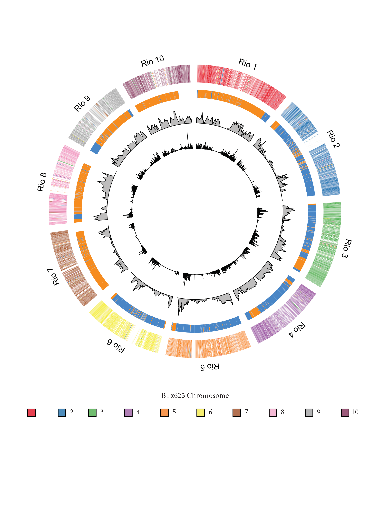

# Rio
Scripts and command lines used to compare the new Rio (sweet sorghum) genome to the original sorghum reference as well as to identify changes in gene expression associated with sugar accumulation.

## Aligning the Genomes and Filtering Output
Step 1: Run the Nucmer alignment option from MUMmer:
```
nucmer --maxmatch -c 200 -l 100 -b 200 -g 500 BTx623.fa Rio.fa
```
Step 2: Run Blat to create pairwise alignments between transcripts:
```
ref1=SbicolorRiov2.1.primaryTrs.fa
ref2=Sbicolor_454_v3.1.1.transcript_primaryTranscriptOnly.fa 

blat -t=dna -q=dna $ref1 $ref2  Rio_Btx_v3.1.1_Blat.psl
```
Step 3: Use the R code in `mummerParse.R` (which in turn relies on the functions in `pan_transcriptome_fxns.R` to perform local alignments of genes within the Mummer blocks identified in the nucmer output from Step 1.  Alignments are created using a Needleman-Wunsch algorithm, with scores calculated from the Blat .psl file created in Step 2.

Step 4: Run [Assemblytics](assemblytics.com) web analysis tool to process the delta file from nucmer. Then run `parseAssemblytics.R` to combine info with the Mummer blocks, and to determine if there are actually colinear gene alignments with regions called as SVs by Assemblytics.

_Note that some further error checking may be needed (i.e. done by hand) for particularly difficult/repetitive regions._

## Creating the Circos Plot
The colinear coordinates `.csv` file was created by extracting the relevant columns from the nucmer `.coords` output.  This  was created with the R code in circos_plot.R.

## Comparing Expression Profiles
Raw RNA sequencing reads were processed into read counts using the following standard tools:
* [Trimmomatic](http://www.usadellab.org/cms/?page=trimmomatic) to filter and trim reads
* [TopHat](https://ccb.jhu.edu/software/tophat/index.shtml) to map trimmed reads to the Rio reference assembly
* [HTSeq] (https://htseq.readthedocs.io/en/release_0.10.0/) to obtain read counts from the BAM files output by TopHat

The counts output from HTSeq were then read directly into R using the DESeq2 package, and differentially expression was assessed using the code in `DESeq_noBL.R.`  The results from DESeq2 were further processed and reads were clustered using the code in `EBSeqHMM_Cluster.R`.  Both scripts rely on functions in `RNAseq_fxns.R`.

## RIL Breakpoint Analysis
Step 1: Raw Illumina HiSeq reads from BTx3197, PR22, and Rio were each trimmed with [Trimmomatic](http://www.usadellab.org/cms/?page=trimmomatic).  Below is an example command line from Rio:
```
java -jar /zfs/gcl/software/trimmomatic/0.36/trimmomatic-0.36.jar PE -threads 15 -trimlog $out/Rio_trim.log Rio_Fastq/1149.6.1254_1.fastq Rio_Fastq/1149.6.1254_2.fastq $out/Rio_paired_1.fq $out/Rio_unpaired_1.fq $out/Rio_paired_2.fq $out/Rio_unpaired_2.fq ILLUMINACLIP:TruSeq3-SE:2:30:10 LEADING:3 TRAILING:3 SLIDINGWINDOW:4:15 MINLEN:36
```
Step 2: Trimmed read pairs from each library were aligned to the Rio genome with [Bowtie2](http://bowtie-bio.sourceforge.net/bowtie2/index.shtml).  Below is an example command line from the Rio library:
```
bowtie2-build Sorghum_rio.mainGenome.fasta Rio

bowtie2 -p 16 -x $raw/Rio --rg-id Rio --rg "SM:Rio" -1 Trimmed_Reads/Rio_paired_1.fq -2 Trimmed_Reads/Rio_paired_2.fq -S Aligned/Rio.sam
```
Step 3: Sam files were converted to BAM, sorted and indexed using [Samtools v1.4](https://sourceforge.net/projects/samtools/files/samtools/1.4/):
```
samtools view -O BAM -@ 8  Rio.sam | samtools sort -o Rio.sort.bam -O BAM -@ 8 -
samtools index -b Rio.sort.bam
```
Step 4: Run the [GatK](https://software.broadinstitute.org/gatk/) HapCaller on each individual sample BAM file.
```
java -jar /panicle/GenomeAnalysisTK.jar -T HaplotypeCaller \
        -I $src/Rio.sort.bam \
        -R $ref/Sorghum_rio.mainGenome.fasta \
        -o $src/Rio.gvcf \
        -ERC GVCF \
        -allowPotentiallyMisencodedQuals \ (This option only necessary with Rio, which had older qual scores)
        -variant_index_type LINEAR \
        -variant_index_parameter 128000
```
Step 5: Run the GatK GenotypeGVCFs tool to get joint genotypes across all 3 samples:
```
java -jar /panicle/GenomeAnalysisTK.jar -T GenotypeGVCFs \
        -R $ref/Sorghum_rio.mainGenome.fasta \
        -o $src/all.vcf \
        --variant BTx3197.gvcf —variant PR22.gvcf —variant Rio.gvcf \
```
_Steps 6, 7 and 8 below can be performed with the R code `RIL.R`_

Step 6: Starting with 1,812,578 SNPs called by GATK, filter the VCF file to remove sites where:
* Any of the 3 individuals has missing data (1,669,843 sites remaining),
* Rio appears polymorphic, i.e. heterozygous (1,614,305 sites remaining),
* BTx3197 appears heterozygous (1,492,327 sites remaining)
* Rio and BTx3197 are the same (1,474,261 sites remaining)

Step 7: In the filtered VCF file, classify each site within PR22 as Parent 0 (Rio) or Parent 2 (BTx3197). (All 0/0 sites are 0, all 1/1 sites are 2, and all 0/1 sites are 1)

Step 8: In windows of 15 SNPs, count the numbers of 0s and 2s (skip the 1s); calculate the proportion of 0:2; if the proportion is >2, classify the site as "R" for Rio; if <0.25, classify the site as "B" for BTx3197; if between 0.25 and 2, classify the site as "H" for Heterozygous.  

Breakpoints occur at any transition from R to B (or vice versa), allowing for the possibility that the state may change to H first (i.e. R -> H -> B).  Changes to "H" that revert back to the original parental type (i.e. R -> H -> R) are NOT breakpoints. 

## Additional Scripts
`exp_wGo.R` uses the differential expression results from DESeq2, along with the breakpoint analysis results and the gene-to-gene alignments from Mummer and Blat to find enriched GO terms among significant DEGs specifically within the context of their genetic background.

`snpsWimpact.R` uses results from [snpEff](http://snpeff.sourceforge.net/) and the differenital expression results from DESeq2 to find differentially expressed genes with a predicted high impact mutation.
